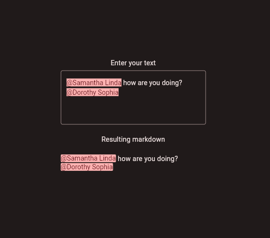
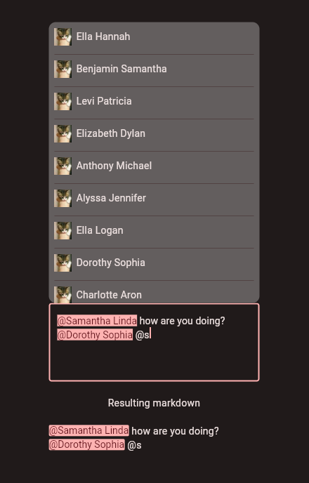

<h1 align="center">
    Simply Mentions
</h1>

<p align="center">
  <i align="center">Support mentioning in your project with all the features you need 🚀</i>
</p>

## Introduction

**Simply Mentions** is a feature-rich mentioning package that supports exporting text to computer-readable syntax, mentioning different items with the same display name, and built-in markdown support.

This package was made in response for a need to mention channels and users in our app. We however lacked a way of doing so that also supports mentioning two or more people with the same name but different userId's. Thus Simply Mentions was made.

## 🎉 Features

* Full visual authority over the mention list
* Full built-in markdown support
* Export mentions to computer-readable syntax (full custom syntax support)
* Initialize a text field with syntax-containing-text
* Duplicate-naming support (Mention different people with different IDs)
* Unlimited mention types support (Users, channels, anything you want)
* Customizable mention payload (Add custom data to your mention payload for the mention list)
* Automatic mention detection (Automatically detects when a mention is being typed)
* On-demand cancel of mentioning (Cancel mentioning with a simple function call)
* More...

</details>

## 📷 Preview




## 🔨 Usage 

To see all usage of Simply Mentions, you can look at [/example/lib/main.dart](/example/lib/main.dart) of this package.

## ⚙️ Prerequisites

If you want to support exporting the text and having it visible in a non-textfield you will need to add the markdown packages to your project. 

* [https://pub.dev/packages/flutter_markdown](https://pub.dev/packages/flutter_markdown)
* [https://pub.dev/packages/markdown](https://pub.dev/packages/markdown)
* [https://pub.dev/packages/remove_diacritic](https://pub.dev/packages/remove_diacritic) (Optional, but useful to remove diacritics from your search query for the mention list)

## ⚡ Quick Getting Started for the textfield ⚡

Everything is done using a MentionTextEditingController, a derived class from TextEditingController with all support for mentioning built in.

Create a new MentionTextEditingController and pass it to any text field of your choosing.

```dart
MentionTextEditingController mentionTextEditingController = MentionTextEditingController(
    mentionSyntaxes: [DocumentMentionEditableSyntax(context)],
    mentionBgColor: Theme.of(context).colorScheme.primary,
    mentionTextColor: Theme.of(context).colorScheme.onPrimary,
    mentionTextStyle: TextStyle(),
    onSugggestionChanged: onSuggestionChanged,
    idToMentionObject: (BuildContext context, String id) =>
        documentMentions.firstWhere((element) => element.id == id));
```

This code will error out because you do not have `documentMentions`, `DocumentMentionEditableSyntax`, or `onSuggestionChanged`. 
Add the `onSuggestionChanged` code to your widget:

```dart
void onSuggestionChanged(MentionSyntax? syntax, String? fullSearchString) {
    // You can do what you want here.
    // Syntax and fullSearchString will be valid when you are currently mentioning.
    // It will be invalid when not mentioning.
    // Usually, you call setState() here to trigger a widget rebuild for the mention list update
    setState((){});
}
```

Then create a list of mentions, you would do this programatically but here a list you can use for testing:

```dart
final List<MentionObject> documentMentions = [
    MentionObject(
        id: "ExampleId1",
        displayName: "Jane Doe",
        avatarUrl: "https://placekitten.com/50/50"),
    MentionObject(
        id: "ExampleId2",
        displayName: "Jane Doe",
        avatarUrl: "https://placekitten.com/60/60"),
    MentionObject(
        id: "ExampleId3",
        displayName: "John Doe",
        avatarUrl: "https://placekitten.com/70/70")
];
```

Then pass this to your textfield:

```dart
TextField(
    // ... Your properties
    controller: mentionTextEditingController,
    // ... Your properties
)
```

Next create the syntax:

```dart
class DocumentMentionEditableSyntax extends MentionSyntax {
  DocumentMentionEditableSyntax(BuildContext context)
      : super(
        // Character that triggers the mention
        startingCharacter: '@',
        // Any text you want that will show when the document/data is not found
        missingText: "Unknown document",
        // Pattern of the id
        pattern: "[a-zA-Z0-9-]{1,}",
        // The leading characters in the syntax, should be something unlikely typed by the user themsleves
        prefix: '<###',
            // The trailing characters in the syntax, should be something unlikely typed by the user themsleves
        suffix: '###>',);
}
```

To create the mentioning list we advise you use the Portal package: [https://pub.dev/packages/flutter_portal](https://pub.dev/packages/flutter_portal)

Once you have that package you can add a PortalTarget around your text field and create a follower widget:

```dart
PortalTarget(
    visible: mentionTextEditingController!.isMentioning(),
    portalFollower: getMentions(),
    anchor: Aligned(
        follower: Alignment.bottomLeft,
        target: Alignment.topLeft,
        widthFactor: 1,
        backup: const Aligned(
        follower: Alignment.bottomLeft,
        target: Alignment.topLeft,
        widthFactor: 1,
        ),
    ),
    child: TextField(
        decoration:
            InputDecoration(border: OutlineInputBorder()),
        maxLines: null,
        minLines: 5,
        controller: mentionTextEditingController,
    )
)
```

Simple(ish) widget to show a list of all mentions, this can be simplified and fully customized to your desire.
Copy this and edit it to your needs

```dart
 Widget getMentions() {
    if (!mentionTextEditingController.isMentioning()) {
      return SizedBox.shrink();
    }

    List<Widget> possibleMentions = [];

    // Remove diacritics and lowercase the search string so matches are easier found
    String safeSearch = removeDiacritics(mentionTextEditingController!.getSearchString());

    documentMentions.forEach((element) {
      // If you have a derived class from MentionObject, you can cast to that here

      String safeName = removeDiacritics(element.displayName.toLowerCase());

      if (safeName.contains(safeSearch)) {
        possibleMentions.add(Padding(
            padding: EdgeInsets.only(bottom: 5),
            child: Ink(
              child: InkWell(
                onTap: () {
                  // Tell the mention controller to insert the mention
                  onMentionSelected(element);
                },
                splashColor: Theme.of(context).highlightColor,
                child: Row(children: [
                  Image.network(
                    element.avatarUrl,
                    width: 25,
                    height: 25,
                  ),
                  SizedBox(
                    width: 6,
                  ),
                  Text(element.displayName)
                ]),
              ),
            )));
      }
    });

    ScrollController controller = ScrollController();

    return Material(
        child: ConstrainedBox(
            constraints: const BoxConstraints(maxHeight: 400),
            child: Container(
                decoration: BoxDecoration(
                    color: const Color.fromARGB(255, 99, 94, 94),
                    borderRadius: BorderRadius.circular(10)),
                child: Scrollbar(
                    controller: controller,
                    child: ListView.separated(
                      controller: controller,
                      shrinkWrap: true,
                      padding: const EdgeInsets.all(8.0),
                      itemCount: possibleMentions.length,
                      separatorBuilder: (context, i) {
                        return const Divider();
                      },
                      itemBuilder: (BuildContext context, int index) {
                        return possibleMentions[index];
                      },
                    )))));
  }
```

React to when a mention was selected:
```dart
 void onMentionSelected(MentionObject mention) {
    setState(() {
      mentionTextEditingController!.insertMention(mention);
    });
  }
```

## ⚡ Quick Getting Started for markdown ⚡

Once you have support for your text field, and you want to show this text including mentions in a text box that is not a text field you can follow this getting started to do so.

First, create a mention markdown syntax:

```dart
class DocumentMention extends MarkdownMentionSyntax {
  DocumentMention()
      : super(
            patternToUse: mentionPattern,
            tagName: 'docMention',
            idRegexGroup: 2,
            startCharacter: 0x3C);

  // Set the pattern, by default <###@USERID###>, however this can be anything.
  // Just make sure it's unlikely to show up in the text naturally.
  static const String mentionPattern = '<###@([a-zA-Z0-9-]{1,})###>';
}
```

Then create the mention markdown builder, there's two builders as an example, one with and one without gesture support.

Without gesture support:
```dart
class DocumentMentionBuilder extends MarkdownMentionBuilder {
  DocumentMentionBuilder(super.onPressed, {required this.context});

  final BuildContext context;

  @override
  Widget createWidget(md.Element element, TextStyle? preferredStyle) {
    final String mentionedId = element.children![0].textContent;

    final mentionIndex =
        documentMentions.indexWhere((element) => element.id == mentionedId);

    // If we don't find it, display the raw text
    if (mentionIndex == -1) {
      return RichText(text: TextSpan(text: mentionedId));
    }

    final String name = documentMentions[mentionIndex].displayName;

    return RichText(
        text: TextSpan(
            text: '@$name',
            style: TextStyle(
                color: Theme.of(context).colorScheme.onPrimary),
        ),
    );
  }
}
```

With gesture support:
```dart
class DocumentMentionBuilder extends MarkdownMentionBuilder {
  DocumentMentionBuilder(super.onPressed, {required this.context});

  final BuildContext context;

  @override
  Widget createWidget(md.Element element, TextStyle? preferredStyle) {
    final String mentionedId = element.children![0].textContent;

    final mentionIndex =
        documentMentions.indexWhere((element) => element.id == mentionedId);

    // If we don't find it, display the raw text
    if (mentionIndex == -1) {
      return RichText(text: TextSpan(text: mentionedId));
    }

    final String name = documentMentions[mentionIndex].displayName;

    return RichText(
        text: TextSpan(children: [
      WidgetSpan(
          baseline: TextBaseline.alphabetic,
          alignment: PlaceholderAlignment.baseline,
          child: GestureDetector(
              onTap: () {
                // Do what you need to do using mentionedId
              },
              child: DecoratedBox(
                  decoration: BoxDecoration(
                      color: Theme.of(context).colorScheme.primary,
                      borderRadius: BorderRadius.circular(2)),
                  child: RichText(
                    text: TextSpan(
                      text: '@$name',
                      style: TextStyle(
                          color: Theme.of(context).colorScheme.onPrimary),
                    ),
                  ))))
    ]));
  }
}
```

Once you have these classes you can create your markdown body:  
You do not **need** to have a `MentionTextEditingController` for a markdown body, you only need the markup text to display it. In our example we show the text field and markdown body below each other so we have access to the controller. In a chat-based app for example you would not have a `MentionTextEditingController`.
```dart
MarkdownBody(
    data: mentionTextEditingController!.getMarkupText(),
    softLineBreak: true,
    builders: {
    // Add the docMention, should match what you wrote in DocumentMention
    'docMention': DocumentMentionBuilder(context: context,
        (String pressedMentiondId) {
            // .. Do what you want to do when you pressed on a member
        })
    },
    // Add your syntax (DocumentMention)
    inlineSyntaxes: [DocumentMention()],
)
```

## 🎓 Useful functions

Several functions exist on the `MentionTextEditingController`, here is a table of the functions:

| Function           | Description                                                                        |
| :----------------- | :--------------------------------------------------------------------------------- |
| `setMarkupText`    | Initialize a textfield with computer-readable syntax-containing(optional) raw text |
| `getSearchText`    | Get the text used to search for a mention when mentioning is active.               |
| `getSearchSyntax`  | Get the syntax used for the current mention and search                             |
| `getMarkupText`    | Get the raw computer-readable syntax-containing text                               |
| `insertMention`    | Insert a mention in the currently typing mention                                   |
| `isMentioning`     | Check if we are currently mentioning                                               |
| `cancelMentioning` | Cancel the current mentioning, if we are mentioning                                |


## 👷 Contributing

You can submit a pull request into the main branch. Please elaborate why the change is needed and what the changes are doing.


## 👑 Contributors 

<a href="https://github.com/Cellaryllis"></a>


## 📜 License 

This project is licensed under BDS-3-Clause